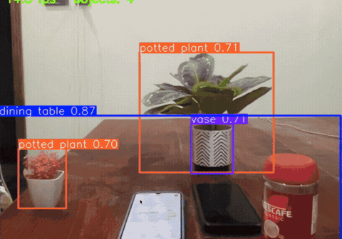

# 🤖 AI Robotics Bootcamp (2026 Industry Edition)

## Course Progress

| | Module | Lesson notes |
|---|---|---|
| ✅ | 1 — Robotics Introduction | — |
| ✅ | 2 — Robot Components | — |
| ✅ | 3 — Electronics Basics | — |
| ✅ | 4 — Python for Robotics (Basic) | below ↓ |
| ✅ | 5 — Development Environment & Programming Foundations | [L8 — Workspace](lessons/lesson-08-professional-workspace.md) · [L9 — Simulation](lessons/lesson-09-robot-simulation.md) · [L10 — Robot Brain](lessons/lesson-10-robot-brain.md) · [L11 — OOP](lessons/lesson-11-oop-for-robotics.md) |
| ✅ | 6 — Sensors | [L12 — Sensors](lessons/lesson-12-sensors.md) |
| ✅ | 7 — Computer Vision | [L13 — Camera](lessons/lesson-13-camera.md) |
| ✅ | 8 — OpenCV | [L14 — OpenCV](lessons/lesson-14-opencv.md) · [L15 — How a Robot Sees](lessons/lesson-15-how-a-robot-sees.md) |
| ✅ | 9 — AI Vision | [L16 — YOLO](lessons/lesson-16-yolo.md) |
| ✅ | 10 — ROS 2 | [L17 — ROS 2](lessons/lesson-17-ros2.md) |
| ✅ | 11 — Linux for Robotics | [L18 — Linux](lessons/lesson-18-linux-for-robotics.md) |
| ✅ | 12 — Software Engineering | [L19 — Git & GitHub](lessons/lesson-19-git-and-github.md) |
| ✅ | 13 — Docker | [L20 — Docker](lessons/lesson-20-docker.md) |
| ✅ | 13 — ROS 2 Practical | [L21 — Choosing Your Setup](lessons/lesson-21-choosing-your-ros2-setup.md) · [L22 — First ROS 2 Program](lessons/lesson-22-first-ros2-program.md) |
| ✅ | Project 1 — MoveBot | [L23 — Dev Environment](lessons/lesson-23-dev-environment.md) · [L24 — Project & Scene Tree](lessons/lesson-24-webots-project-and-scene-tree.md) · [L25 — First Robot](lessons/lesson-25-movebot-first-robot.md) |
| ✅ | Project 2 — Obstacle Avoidance | [L26 — Obstacle Avoidance](lessons/lesson-26-obstacle-avoidance.md) |
| ✅ | 14 — Autonomous Robotics | [L27 — SLAM](lessons/lesson-27-slam.md) |
| ✅ | 15 — Navigation | [L28 — Path Planning](lessons/lesson-28-path-planning.md) |
| 🔄 | 16 — Computer Vision for Robotics | [L29 — CV Fundamentals](lessons/lesson-29-computer-vision-fundamentals.md) · [L30 — OpenCV Practical](lessons/lesson-30-opencv-practical.md) · [L31 — Image Processing](lessons/lesson-31-image-processing.md) · [L32 — Face Detection](lessons/lesson-32-face-detection.md) |
| 🔄 | 17 — AI Vision | [L36 — Tracking & Following](lessons/lesson-36-object-tracking-following.md) · [L37 — Pose Estimation](lessons/lesson-37-pose-estimation.md) · [L38 — Hand Gestures](lessons/lesson-38-hand-gestures.md) |

## Live Object Detection



*YOLO11 detecting 8 objects at once — bottles, phones, a potted plant, a vase and the table — at ~15 fps on a MacBook Air M1, with no GPU. Run it yourself with [`yolo_camera.py`](yolo_camera.py).*

---

**Check your toolchain at any time:** `python3 setup_check.py`

**OpenCV lessons** need the virtual environment: `source .venv/bin/activate` (see [Lesson 14](lessons/lesson-14-opencv.md))

---

# Python for Robotics — Variables & Decisions

*Module 4*

You already know Python. Robotics Python is a different *way of thinking*, not a different language.

In this lesson we learn to think like a robot.

---

## 1. What Is Robot Programming?

A normal program is a straight line:

```
User Input  →  Process  →  Print Result
```

A robot program is a loop that touches the physical world:

```
Sensor  →  Decision  →  Motor  →  Movement
              ↑                       │
              └───────── feedback ────┘
```

That cycle — **sense, decide, act** — is the core concept of robotics.
Every robot, from a $30 line follower to a Tesla, runs this loop.

---

## 2. Variables

### Definition

A variable is a labelled box that stores a piece of data.

Think of the storage boxes in a house: one box holds shoes, another holds
books, another holds clothes. Each box has a label so you know what is inside.
Python works the same way — the label is the variable name.

### Examples

```python
battery = 90            # robot battery is at 90%
distance = 25           # wall is 25 cm away
robot_name = "Atlas"    # the robot's name
```

### A real robot example

The ultrasonic sensor reports a reading of 10 cm. In Python:

```python
distance = 10
```

The robot can now *decide* what to do with that number.

---

## 3. Decision Making

```python
distance = 10

if distance < 20:
    print("Stop")
```

In plain English: **if the wall is closer than 20 cm, stop the robot.**

This is where robot intelligence begins.

### Real world: a Tesla

```
Camera  →  Distance estimate  →  Python/C++ logic  →  Brake
```

Same logic, more sensors.

### Real world: a robot vacuum

```python
distance = 5

if distance < 15:
    print("Turn left")
```

---

## 4. Data Types a Robot Uses

| Type | Meaning | Robot example |
|------|---------|---------------|
| `int` | whole number | `wheels = 4` |
| `float` | decimal number | `distance = 1.25` (metres) |
| `bool` | True / False | `obstacle = True` |
| `str` | text | `robot_name = "Optimus"` |

### Boolean — the robot's yes/no questions

A robot constantly asks yes/no questions: *Is there an obstacle? Is the
battery low? Is the arm holding something?*

```python
obstacle = True

if obstacle:
    print("Stop robot")
```

Note: `if obstacle:` already means *if obstacle is True* — no `== True` needed.

### String — the robot can speak

```python
robot_name = "Optimus"
voice = "Welcome"
```

### Float — precise measurement

Distances and speeds are rarely whole numbers.

```python
distance = 1.25   # metres
```

### Integer — countable things

```python
wheels = 4
```

---

## 5. A Robot's State in Variables

```python
battery = 95          # percent
temperature = 30      # degrees Celsius
speed = 1.5           # metres per second
robot_name = "NaeemBot"
obstacle = False
```

Together these variables describe **the robot state** at one moment in time.
Keep this idea in mind — it becomes important in ROS 2.

---

## 6. Practical Projects

### Project 1 — Robot identity

Create a file called `robot.py`:

```python
robot_name = "NaeemBot"
battery = 100
speed = 1.2

print(robot_name)
print(battery)
print(speed)
```

Output:

```
NaeemBot
100
1.2
```

### Project 2 — Battery drain

```python
battery = 80
battery = battery - 10
print(battery)
```

Output:

```
70
```

The robot has used 10% of its battery. The right-hand side is calculated
first, then stored back into the same box.

### Project 3 — Obstacle check

```python
distance = 15

if distance < 20:
    print("Robot stop")
else:
    print("Move")
```

Output:

```
Robot stop
```

---

## 7. Think About It 🤔

What is the output if `distance = 50`?

<details>
<summary>Answer</summary>

```
Move
```

50 is not less than 20, so the `else` branch runs.
</details>

---

## 8. Mini Challenge

Write this yourself: if the robot's battery is below 20%, print

```
Battery low
Go charging
```

otherwise print

```
Keep working
```

Hint: start with `battery = 15`.

A worked solution is in [`challenge_solution.py`](challenge_solution.py) —
try it on your own first.

---

## 💡 One Important Note

This course does not teach syntax alone. Every line comes with the robotics
reason behind it.

When we move to **ROS 2**, these same variables become **topics**, **sensor
messages**, and **robot state**. `distance = 10` becomes a subscriber reading
a `LaserScan` message. The thinking stays identical; only the plumbing grows.

---

## 📚 Homework

1. Create `robot.py`.
2. Run all three projects yourself.
3. Solve the battery challenge.
4. Push the code to a GitHub repository named `robotics-learning`. ✅ (this repo)

---

## Files in This Repository

| File | Description |
|------|-------------|
| [`robot.py`](robot.py) | All lesson examples in one runnable script |
| [`robot_lesson.ipynb`](robot_lesson.ipynb) | The same lesson as an interactive notebook |
| [`challenge_solution.py`](challenge_solution.py) | Solution to the battery mini challenge |
| [`setup_check.py`](setup_check.py) | Checks your robotics toolchain (Lesson 8) |
| [`robot_brain.py`](robot_brain.py) | Sense→Think→Act decisions and a state machine (Lesson 10) |
| [`robot_oop.py`](robot_oop.py) | Classes, objects, and a robot built from parts (Lesson 11) |
| [`pixels_demo.py`](pixels_demo.py) | Builds an image from raw numbers, saves real PNGs (Lesson 13) |
| [`image_analyzer.py`](image_analyzer.py) | OpenCV pipeline: resize → gray → blur → edges (Lesson 14) |
| [`see_like_a_robot.py`](see_like_a_robot.py) | The same image as a picture and as numbers (Lesson 15) |
| [`detection_demo.py`](detection_demo.py) | Bounding boxes, confidence thresholds, robot decision (Lesson 16) |
| [`mini_ros.py`](mini_ros.py) | A working nodes-and-topics pub/sub system (Lesson 17) |
| [`linux_check.sh`](linux_check.sh) | Which Linux commands work on your machine (Lesson 18) |
| [`git_practice.sh`](git_practice.sh) | Safe Git sandbox: init → commit → branch → merge (Lesson 19) |
| [`ros2_style_demo.py`](ros2_style_demo.py) | Real ROS 2 node code, runnable without ROS 2 (Lesson 22) |
| [`mini_rclpy.py`](mini_rclpy.py) | A ~100-line stand-in for ROS 2's rclpy (Lesson 22) |
| [`new_project.sh`](new_project.sh) | Scaffolds a professional project structure (Lesson 23) |
| [`world_inspector.py`](world_inspector.py) | Prints a Webots world's Scene Tree from the text file (Lesson 24) |
| [`slam_demo.py`](slam_demo.py) | Builds a map from laser scans, with and without position drift (Lesson 27) |
| [`path_planning_demo.py`](path_planning_demo.py) | Dijkstra vs A* on one map, with cells-examined counts (Lesson 28) |
| [`traditional_vs_ai_vision.py`](traditional_vs_ai_vision.py) | Watch a hand-written vision rule fail 4 of 5 tests (Lesson 29) |
| [`camera_app.py`](camera_app.py) | Live camera with photo/video keyboard control (Lesson 30) |
| [`image_processing_demo.py`](image_processing_demo.py) | Every core operation, plus BGR vs HSV under changing light (Lesson 31) |
| [`face_detection.py`](face_detection.py) | Haar cascade face detection, live or single-frame (Lesson 32) |
| [`yolo_camera.py`](yolo_camera.py) | Live YOLO object detection on the camera (Lessons 34–35) |
| [`object_follower.py`](object_follower.py) | Tracks an object and decides turn left / right / forward (Lesson 36) |
| [`pose_estimation.py`](pose_estimation.py) | Skeleton keypoints, raised-hand and fall detection (Lesson 37) |
| [`hand_gestures.py`](hand_gestures.py) | 21 hand landmarks → gesture → robot command (Lesson 38) |
| [`lessons/`](lessons/) | Lesson notes from Lesson 8 onward |
| [`docs/`](docs/) | Portfolio and content strategy |
| [`assets/`](assets/) | Demo images and GIFs |
| [`controllers/`](controllers/) | Webots robot controllers (run from inside Webots) |
| [`worlds/`](worlds/) | Webots simulation worlds — open these and press Run |

### How to run

```bash
python3 robot.py
python3 challenge_solution.py

# for the notebook
pip install notebook
jupyter notebook robot_lesson.ipynb
```
